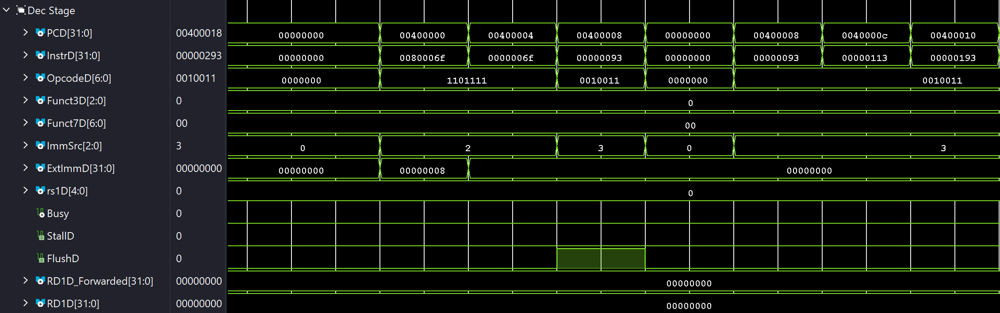

# Simulation

This section outlines the verification strategy for the Mach-V processor.

## Simulation Directory Structure

The `sim/` directory contains all testbench and verification artifacts:

* **`sim/tb/`**: Verilog testbenches mapped to specific [software applications](../sw/index.md).
* **`sim/mem/`**: Pre-compiled memory files (in hexadecimal format) used to initialize IROM and DMEM for simulation.

## Toolchain Setup

The primary tool used for simulation is **[Vivado 2025.2](https://www.xilinx.com/support/download.html)**. For installation instructions, refer to the [NUS CG3207 Lab Guide](https://nus-cg3207.github.io/labs/getting_started/vivado_install_guide/) or consult the official Xilinx documentation.

## Simulation Guide

Simulations for Mach-V are performed by targeting the Wrapper.v module as the Device Under Test (DUT). Acting effectively as a virtual motherboard, this module connects the processor core to peripherals like UART and memory.

### Debugging the Pipelined Processor

Personally speaking, debugging a pipelined microarchitecture can be tedious due to instructions overlapping across different stages. To simplify this process, I recommend **propagating the current PC value through every stage of the pipeline**.

By latching `PCF` into successive pipeline registers (e.g., `PCD`, `PCE`, `PCM`, `PCW`), you can easily identify exactly which instruction is occupying a specific stage at any given cycle.

For example, the waveform below shows the Decode (Dec) stage while executing the [Coremark](https://www.google.com/search?q=../sw/benchmark.md) application:


/// caption
Decode Stage with PC Propagation
///

In the waveform above, the `PCD` signal indicates the instruction currently residing in the Dec stage. This makes it significantly easier to verify if the control signals match the expected behavior. For reference, here is the corresponding snippet from `prog.dump`:

```riscv
400000:   0080006f           j 400008 <_init_reg>
400004:   0000006f           j 400004 <_end>
400008:   00000093           li ra,0
40000c:   00000113           li sp,0
400010:   00000193           li gp,0
400014:   00000213           li tp,0
```

!!! warning
    While this method has been effective for Phase 2 of Mach-V, there may be more efficient debugging techniques. I will continue to explore other methods and update this section as the design evolves.

### Handling "Fly-Away" Situations (Undefined States)

Occasionally, you may encounter a situation where signals (such as `PCF`) suddenly transition to `XXX` (undefined). This usually indicates that the processor has entered an invalid state. These issues can be difficult to trace, but below are some common causes I have encountered.

!!! info "Rule of Thumb"
    Locate the **last valid instruction** in the waveform before the signals go undefined. Use the PC value of that instruction to find the corresponding RISC-V instruction in your `prog.dump` file (generated after running `make`).

---

#### `lw` Loading from an Invalid Address

This issue typically occurs when a load instruction attempts to access an address that is not mapped to the DMEM. If the data is missing from the memory initialization, the simulation returns undefined values.

To resolve this, check if the source address of the load instruction falls within a section that has been put into the DMEM. This kind of information is specified in the linker script (`ld.script`).

!!! tip
    A common pitfall is the `.rodata` (read-only data) section. Ensure that `.rodata` is explicitly included in the DMEM mapping in your linker script.
